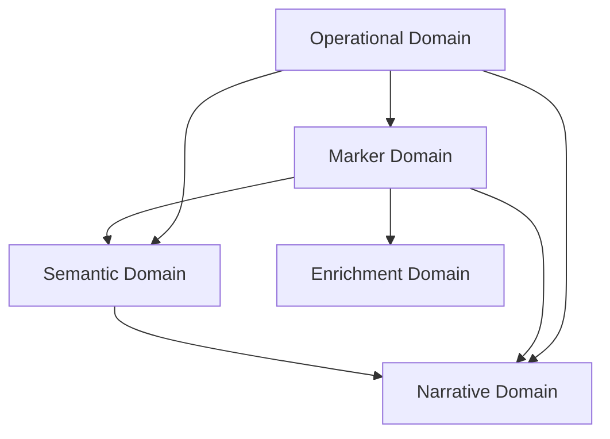

# Data Model

**Document Status**: Draft  
**Last Updated**: 2026-04-05  
**Maintainer**: Engineering

## Overview

This document defines the data structures used in LeanDeep 6.0, organized by domain. All structures are implemented as Pydantic models (Python) and serialized as JSON in API responses. Marker source data is stored as YAML in `build/markers_rated/`.

The data model has 5 domains:



---

## 1. Marker Domain

### Marker (Source of Truth)

**Storage**: YAML files in `build/markers_rated/{1_approved,2_good,3_needs_work,4_not_usable}/`  
**Runtime**: Compiled into `build/markers_normalized/marker_registry.json` via `tools/normalize_schema.py`

```python
class Marker(BaseModel):
    id: str                              # "ATO_HESITATION"
    layer: str                           # ATO | SEM | CLU | MEMA
    family: str                          # "MODAL_DOUBT" (for family multipliers)
    pattern: str                         # regex or keyword string
    pattern_type: str                    # "regex" | "keyword" (not "emoji")
    description: Dict[str, str]          # {"de": "...", "en": "..."}
    vad: VADScores                       # valence, arousal, dominance
    semantic_affinity: Optional[dict]    # semantic gating rules
    resonance_tags: List[str]            # NEW: ["uncertainty", "self-doubt", "avoidance"]
    examples: List[Example]              # positive examples
    negatives: List[str]                 # patterns to NOT match
    activation: Optional[dict]           # SEM/CLU: {mode, min_components, window}
    composed_of: Optional[List[str]]     # component marker references (metadata only)
    rating: int                          # 1=production, 2=good, 3=needs_work, 4=unusable
    compositionality: str                # deterministic(1.0x) | contextual(0.7x) | emergent(0.5x)
    context_only: bool = False           # hidden from output, available for SEM composition
```

**Notes**:
- `resonance_tags`: 3-5 semantic tags per marker, used by Frame Resonance Weighting (REQ-F-marker-resonance-weighting)
- `composed_of` is metadata, not enforcement — per CON-no-compose-of-rules
- Pattern type "emoji" is skipped during compilation (only "regex" and "keyword" compiled)
- 3-char minimum match filter applied at runtime to reduce noise

### DetectedMarker (Runtime Detection Result)

**Lifecycle**: Created during analysis pipeline, included in API response, not persisted beyond cache TTL.

```python
class DetectedMarker(BaseModel):
    id: str                              # marker ID
    layer: str                           # ATO | SEM | CLU | MEMA
    family: str                          # marker family
    confidence: float                    # raw detection confidence (0.0-1.0)
    resonance_score: float               # frame alignment score (0.0-1.0)
    adjusted_confidence: float           # confidence * resonance_score
    tier: str                            # "STRONG" (>=0.5) | "WEAK" (0.2-0.5) | "DISCARDED" (<0.2)
    span: Tuple[int, int]                # character offsets in source text
    text_match: str                      # matched text substring
    meaning_in_context: str              # contextual interpretation (konjunktiv phrasing)
    vad: VADScores
```

**Traceability**: REQ-F-marker-resonance-weighting (tier categorization, resonance scoring), REQ-COMP-professional-interpretability (meaning_in_context with konjunktiv), REQ-USA-interactive-visualization (span for highlighting, tooltip content)

---

## 2. Semantic Domain

### SemanticFrame (NEW — Per Dialogue)

**Lifecycle**: Generated by LLM at analysis time. Cached with analysis result. Not persisted independently.

```python
class SemanticFrame(BaseModel):
    tone: str                            # 2-3 adjectives: "hesitant, uncertain, defensive"
    themes: List[str]                    # ["self-doubt", "decision-making"]
    relational_dynamics: str             # "seeking-support" | "adversarial" | "exploratory" | ...
    intent: str                          # "information-seeking" | "persuasion" | "connection" | ...
    emotional_tenor: float               # -1.0 (very negative) to 1.0 (very positive)
    context_validity: float              # 0.0-1.0: resolvable references / total references
    offline_context_risk: float          # 0.0-1.0: external tensions / total tensions
```

**Dimension semantics**:
- `context_validity`: 1.0 = all references self-contained; 0.0 = nothing self-explanatory
- `offline_context_risk`: 1.0 = all tensions from hidden context; 0.0 = all explained internally
- These two metrics drive narrative count scaling (DEC-context-uncertainty-proportional-variance)

**Traceability**: REQ-F-semantic-framing (all 7 dimensions), REQ-F-multi-narrative-analysis (offline_context_risk drives narrative_count)

### SemanticProfile (Existing — Per Text Unit, Layer 0)

**Lifecycle**: Generated by semantic profiler (api/semantic.py). Used for semantic gating.

```python
class SemanticProfile(BaseModel):
    intent: str                          # speech act intent
    register: str                        # formal | informal | technical
    emotion: str                         # positive | neutral | negative
    ironie: bool                         # irony detection
    selbst_fremd: str                    # self | other | mixed
    beziehungsdynamik: str               # relationship dynamics category
    pre_context: str                     # prior context category
    tension: float                       # 0.0-1.0 emotional/relational tension
```

**Note**: SemanticProfile (Layer 0, per-message) is distinct from SemanticFrame (per-dialogue). The profile drives semantic gating; the frame drives resonance weighting and narrative generation.

---

## 3. Narrative Domain (NEW)

### SupportingMarker (Marker Reference Within Narrative)

```python
class SupportingMarker(BaseModel):
    id: str                              # marker ID
    adjusted_confidence: float           # confidence after resonance weighting
    span: Tuple[int, int]                # character offsets for UI linking
    meaning_in_context: str              # konjunktiv phrasing
```

### Narrative (One Interpretation)

**Lifecycle**: Generated by LLM during analysis. Included in API response. Cached with analysis result.

```python
class Narrative(BaseModel):
    narrative_id: int                    # 1-based sequential
    type: str                            # "Primary" | "Contrarian" | "Novel" |
                                         # "High-Uncertainty" | "Weak Cluster"
    text: str                            # interpretation text (konjunktiv phrasing)
    confidence: float                    # avg supporting marker confidence
    supporting_markers: List[SupportingMarker]  # >= 2 markers per narrative
    uncertainty_warning: Optional[str]   # populated when offline_context_risk >= 0.6
    score: float                         # ranking score (resonance*0.5 + novelty*0.3 + coherence*0.2)
```

**Invariants**:
- `len(supporting_markers) >= 2` for all narrative types
- Narrative count = `3 + floor(offline_context_risk * 2)`, capped at 4
- Pairwise similarity between narratives < 0.6 (embedding-based diversity check)

**Traceability**: REQ-F-multi-narrative-analysis (dynamic count, grounding, ranking), REQ-COMP-professional-interpretability (konjunktiv text, evidence grounding, uncertainty warnings)

### WeakMarkerCluster (Clustered Weak Markers)

```python
class WeakMarkerCluster(BaseModel):
    markers: List[DetectedMarker]        # weak-tier markers in cluster
    coherence: float                     # LLM-assigned (0.0-1.0); >= 0.7 to form perspective
    cluster_meaning: str                 # LLM-generated semantic summary
    confidence: float                    # avg(component marker adjusted_confidences)
```

**Invariant**: Cluster only forms when `len(markers) >= 2` and `coherence >= 0.7`

**Traceability**: REQ-F-marker-resonance-weighting (weak marker clustering)

---

## 4. Enrichment Domain (NEW)

### ExamplePassage (Shared by Candidates)

```python
class ExamplePassage(BaseModel):
    text: str                            # exact passage text
    context: str                         # surrounding 2 sentences
    source_dialogue_hash: str            # hash reference to source (no raw dialogue stored)
    confidence: float                    # detection confidence
```

**Note**: Raw dialogue text is NOT stored per REQ-SEC-data-handling. Only the passage excerpt and a hash reference are retained.

### MarkerCandidate (Proposed New Marker)

**Storage**: JSON file `build/enrichment/candidates.json` (append-only queue, reviewed via UI)

```python
class MarkerCandidate(BaseModel):
    candidate_id: str                    # auto-generated UUID
    example_passages: List[ExamplePassage]  # >= 3 coherent passages
    cluster_meaning: str                 # LLM-generated semantic summary
    frequency: int                       # occurrence count across analysed corpus
    related_markers: List[str]           # closest existing marker IDs
    coherence: float                     # cluster coherence score (0.0-1.0)
    status: str                          # "proposed" | "approved" | "rejected" | "merged"
    created_at: datetime
    reviewed_by: Optional[str]           # researcher ID
```

**Traceability**: REQ-F-candidate-detection (candidate detection, quality metrics, researcher actions)

### ExampleCandidate (Proposed Example for Existing Marker)

**Storage**: JSON file `build/enrichment/example_candidates.json`

```python
class ExampleCandidate(BaseModel):
    marker_id: str                       # target marker ID
    passage: ExamplePassage
    semantic_explanation: str            # "This is a good example because..."
    status: str                          # "proposed" | "approved" | "rejected" | "refined"
    created_at: datetime
    reviewed_by: Optional[str]
```

**Invariant**: Only marker hits with `adjusted_confidence >= 0.85` become candidates

**Traceability**: REQ-F-example-auto-enrichment (auto-proposal, quality gates, researcher actions)

### MarkerChangeRecord (Audit Trail)

**Storage**: JSON file `build/enrichment/changelog.json` (append-only log)

```python
class MarkerChangeRecord(BaseModel):
    change_id: str                       # auto-generated UUID
    marker_id: str                       # affected marker ID
    change_type: str                     # "new_marker" | "new_example" | "schema_update" | "deprecation"
    actor: str                           # "system:auto_enrichment" | "system:candidate_detection" | "human:<name>"
    timestamp: datetime
    before_state: Optional[dict]         # previous state snapshot (for revert)
    after_state: dict                    # new state snapshot
    source: str                          # "auto_enrichment" | "candidate_detection" | "manual"
```

**Capabilities**:
- Query by marker_id to get per-marker version history
- Revert: restore `before_state` to marker file
- Report: aggregate by time period for coverage metrics

**Traceability**: REQ-MNT-marker-evolution-tracking (audit trail, revert, reporting)

---

## 5. Operational Domain

### AnalysisResult (Full API Response)

```python
class AnalysisResult(BaseModel):
    frame: Optional[SemanticFrame]               # None if framing failed (degraded mode)
    markers: List[DetectedMarker]                # STRONG + WEAK tiers (DISCARDED excluded)
    narratives: List[Narrative]                  # 3-4 ranked interpretations
    weak_clusters: List[WeakMarkerCluster]       # clusters that formed perspectives
    semantic_profile: Optional[SemanticProfile]  # Layer 0 profile
    vad_trajectory: Optional[List[VADPoint]]     # per-message VAD scores
    degraded: bool = False                       # true if fallback was used
    provider_used: str                           # actual provider that served request
    fallback_reason: Optional[str]               # "timeout" | "error" | "unavailable"
    duration_ms: int                             # total processing time
```

**Degraded mode behavior** (REQ-REL-provider-fallback):
- If semantic framing fails: `frame=None`, markers returned without resonance weighting
- If narrative generation fails: `narratives=[]`, frame + markers returned
- `degraded=True` and `fallback_reason` populated whenever fallback chain was activated

**Traceability**: REQ-F-rest-api (response structure), REQ-REL-provider-fallback (degraded mode fields), REQ-SEC-data-handling (no raw dialogue in response beyond original input)

### CacheEntry

**Storage**: In-memory (LRU) or Redis (if configured)

```python
class CacheEntry(BaseModel):
    key: str                             # hash(dialogue_text)
    result: AnalysisResult
    created_at: datetime
    ttl_seconds: int = 86400             # 24 hours default
    invalidated_by: Optional[str]        # "registry_update" | "manual"
```

**Invalidation triggers**:
- TTL expiry (24h default)
- New `marker_registry.json` deployed (automatic)
- User clicks "Reanalyze" (manual)

**Traceability**: REQ-PERF-conversation-latency (cache hit < 10ms)

### VADPoint

```python
class VADPoint(BaseModel):
    valence: float                       # -1.0 to 1.0
    arousal: float                       # 0.0 to 1.0
    dominance: float                     # 0.0 to 1.0
    message_index: int                   # position in conversation
```

### VADScores (Shared)

```python
class VADScores(BaseModel):
    valence: float                       # -1.0 to 1.0
    arousal: float                       # 0.0 to 1.0
    dominance: float                     # 0.0 to 1.0
```

### Persona (Pro Tier)

**Storage**: YAML files in persistent volume

```python
class Persona(BaseModel):
    token: str                           # unique identifier
    ewma_state: VADScores                # exponential weighted moving average
    episodes: List[Episode]              # detected episodes with transitions
    markers_detected: Dict[str, int]     # frequency map for pattern learning
    consent_given: bool                  # explicit consent for data storage
    created_at: datetime
    last_updated: datetime
```

**Invariant**: Persona data only stored when `consent_given=True` (REQ-SEC-data-handling)

### Episode (Pro Tier)

```python
class Episode(BaseModel):
    episode_id: str
    start_index: int                     # message index
    end_index: int
    transition_type: str                 # type of shift detected
    vad_before: VADScores
    vad_after: VADScores
    markers_in_episode: List[str]        # marker IDs detected
```

---

## Storage Summary

| Data | Storage | Persistence | Notes |
|------|---------|-------------|-------|
| Marker definitions | YAML (`build/markers_rated/`) | Permanent | Source of truth, git-tracked |
| Marker registry | JSON (`build/markers_normalized/`) | Generated | Never edit directly |
| Analysis results | Cache (memory/Redis) | TTL-based (24h) | No raw dialogue persisted |
| Enrichment candidates | JSON (`build/enrichment/`) | Permanent | Append-only queues |
| Change records | JSON (`build/enrichment/changelog.json`) | Permanent | Append-only audit log |
| Personas | YAML (persistent volume) | Permanent | Consent-gated |

---

## Requirement Coverage

| Requirement | Structures | Covered |
|---|---|---|
| REQ-F-semantic-framing | SemanticFrame | Yes |
| REQ-F-marker-resonance-weighting | DetectedMarker, WeakMarkerCluster | Yes |
| REQ-F-multi-narrative-analysis | Narrative, SupportingMarker | Yes |
| REQ-USA-interactive-visualization | DetectedMarker.span, .meaning_in_context | Yes |
| REQ-PERF-conversation-latency | CacheEntry | Yes |
| REQ-F-candidate-detection | MarkerCandidate, ExamplePassage | Yes |
| REQ-COMP-professional-interpretability | konjunktiv fields, Narrative.uncertainty_warning | Yes |
| REQ-F-example-auto-enrichment | ExampleCandidate | Yes |
| REQ-MNT-marker-evolution-tracking | MarkerChangeRecord | Yes |
| REQ-F-rest-api | AnalysisResult | Yes |
| REQ-SCA-rate-limiting | N/A (middleware, not data model) | N/A |
| REQ-SEC-data-handling | Persona.consent_given, CacheEntry.ttl, no raw storage | Yes |
| REQ-REL-provider-fallback | AnalysisResult.degraded, .provider_used, .fallback_reason | Yes |
